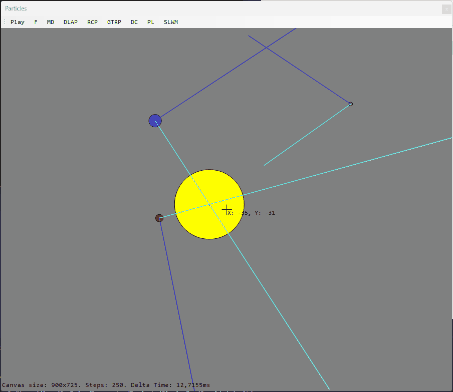

# Gravity Simulation

A simple gravity project, made with the purpose of learning

I wrote the code from scratch when I was 14 years old. I decided to put the project on github because it was an interesting project.

